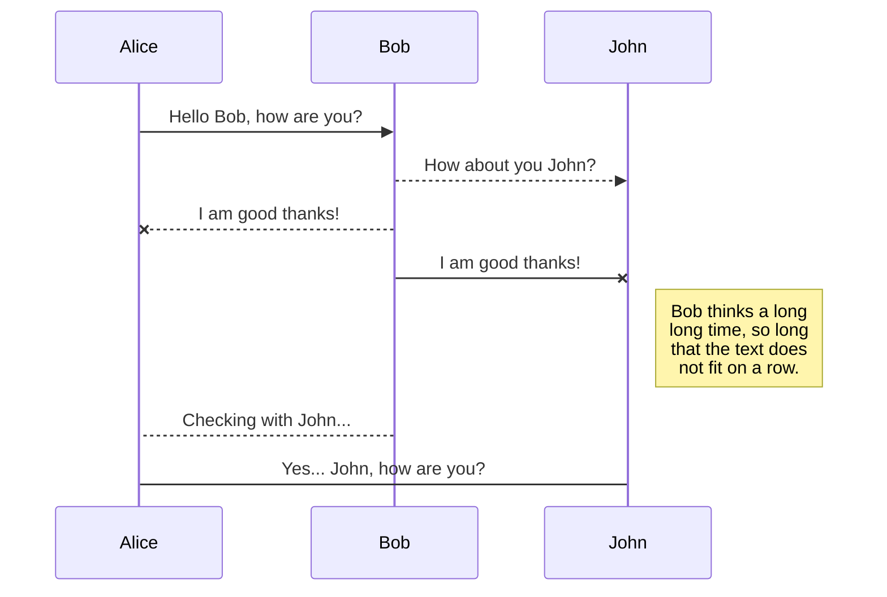
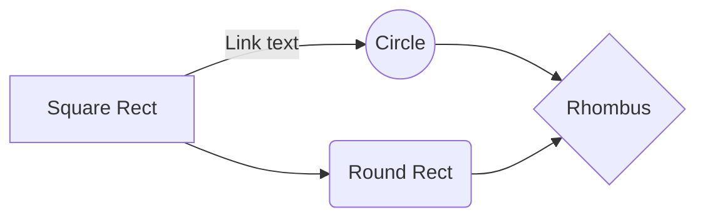

# Springboot Kotlin MVC Template

## 프로젝트 설명
- 본 프로젝트는 제 개발 라이프에서 경험한 다양한 상황, 다양한 기능들에 대해 정리한 프로젝트입니다.

  이 프로젝트 자체로는 매력적인 서비스를 구현한 것이 아니지만, **잘 만들어진 공구함**이라 생각하시면 좋습니다.

  개발을 진행하며 처음 구현하는 기능의 경우는 이곳에 작성하고, 가공하고, 테스트를 하여 준비를 하고, 그렇게 준비된 코드라는 이름의 공구를 진행 중인 서비스에 사용하는 방식으로 쌓아 올린 프로젝트이므로, 추후 동일한 기능을 구현해야 할 때에는 편하게 본 프로젝트에서 해당 코드를 가져와 바로 적용이 가능하게 되는 것입니다.
- 본 프로젝트는 한번 구현한 기능과 직접 작성한 코드라고 할지라도 낯설어지고 어색해지는 것을 방지하고자 하는 취지에서 만들었습니다.

  제가 진행하는 프로젝트에서 경험했거나, 혹은 앞으로 필요하다고 생각하는 기술들을 분리하기 좋은 형태로 만들어 재활용이 쉽게 하였으며, 그로 인하여 **코드 구현에 구애 받지 않고 보다 고도의 기능 구현에 집중할 수 있도록 정리하는 것이 목적**인 프로젝트입니다.
- 만약 본 템플릿 프로젝트를 읽는 법을 배우신다면 본 프로젝트에서 제공하는 기능들에 대해 바로 적용 및 응용이 가능하게 될 것이며, 그에 나아가 템플릿을 수정하고 본인의 스타일에 맞게 작성 하는 법을 배우신다면 제가 그러했듯 큰 도움이 되리라 생각이 됩니다.

## 코딩 규칙
### 표기법 정리
- 폴더명은 snake 표기법을 사용합니다. (ex : test_folder)
- Kotlin 파일명은 파스칼 표기법을 사용합니다. (ex : TestClass)
- Kotlin 파일명 작명 규칙에 예외가 존재합니다.
  src/main/kotlin/{project}/data_sources 폴더 안의
  database_sources, mongo_db_sources, redis_sources 안의 파일명은 파스칼 표기법을 따르면서도, 언더바(_) 가 포함됩니다.(ex : Db0_TestSchema_TestTable) 이에 대해서는 아래의 프로젝트 구조 설명에서 설명합니다.
- Kotlin 코드 내의 변수명, 함수명, 클래스명 등의 명명 규칙은 Kotlin 코딩 규칙을 따르며, 예외가 있을 시 이곳에 표시할 것입니다.
- application.yml 의 key 는 케밥 표기법을 사용합니다. (ex : test-key)
- 작명 방식에 대한 설명은 아래의 프로젝트 구조 설명에서 언급하겠습니다.

### 추가 규칙
- 날짜 데이터 관련하여 다루는 기본 형태는 **yyyy_MM_dd_'T'_HH_mm_ss_SSS_z** 형태를 기본으로 하여, 상황에 따라 조절하세요.
- 본 프로젝트에서 자동 로깅 필터는 multipart/form-data 형식의 Request Body 는 로깅하지 않습니다.
  이 경우에는 수동으로 로깅 처리를 해주셔야 합니다.

## 프로젝트 구조 및 상세 설명
### Root
- Root 폴더 내에는 .gitignore 파일, build.gradle.kts 파일 등이 존재합니다. 되도록 이 위치에는 기본 파일 외에는 추가하지 않습니다.

### .gitignore
- VCS git 에서 버전관리에 포함시키지 않을 목록을 설정하는 파일입니다. 본 프로젝트에서의 특이점은,
  /by_product_files 폴더 내의 모든 파일을 git 에서 무시하라고 설정한 것으로, 뒤에서 설명할 by_product_files 폴더는 log 파일 등과 같이 프로젝트가 실행되며 그 부산물로 생성되는 파일이므로 VCS 에서 제외한 것입니다.

### build.gradle.kts
- Gradle 설정 파일입니다. 본 프로젝트에만 적용되는 특이한 점은 없으며, 상황에 맞게 설정하여 사용하시면 됩니다.
  주의점으로는, 종속성 라이브러리의 버전 변경, 설정 변경시에는 관련된 기능들을 반드시 테스트 하셔야 합니다. 후에 설명드릴 Swagger 웹 문서를 이용하신다면 테스트를 편히 수행하실 수 있습니다.

### TODO.txt

- 프로젝트 전역에 있어 처리해야 할 일들을 정리하여 게시하는 용도의 텍스트 파일입니다.

### by_product_files
- 이 폴더는 프로젝트가 실행되며 생성되는 여러 파일 분산물들을 모아두는 폴더입니다. 대표적으로는 로그 파일이 그러합니다.
- 이 폴더의 모든 파일들은 VCS 에서 관리하지 않습니다.
- 요약하자면, 프로젝트 실행 과정에서 생성되는 파일이자, VCS 에서 관리하지 않는 파일들은 이곳에 저장하도록 하면 됩니다.

### external_files
- 개발자가 임의로 프로젝트와 함께 저장하는 파일은 이곳에 모아둡니다.
- 본 프로젝트에서는 본 프로젝트를 실행하기 위한 외부 서비스를 실행시키기 위한 설정이 모여있는 dockers 폴더, API 테스트시에 사용할 용도로 준비된 파일들을 모아둔 files_for_api_test 폴더, 그리고 개인적인 개발 노하우 등을 정리해둔 문서들을 보관한 knowledges 폴더가 존재합니다.

### test
- Springboot 테스트용 @SpringBootTest 클래스를 모아두는 폴더입니다. 저의 경우는 TDD 를 따로 하지 않고, 별도 클라이언트 프로젝트를 만들거나, Swagger 문서로 수동으로 테스트 하는 방식을 사용하는데, 혹 TDD 를 하실 분이라면 적극적으로 사용하세요.
- 현재는, @ActiveProfiles("dev", "prod") 이 설정으로 인하여 gradle build 중에 자동으로 dev, prod 설정으로 프로젝트 연결 테스트(JPA 검증, 라이브러리 설정 검증, 실행 검증)만을 수행합니다.

### Resources/static

- springboot 기본 생성 폴더로, 외부에서도 접근 가능한 static 리소스 파일을 저장하는 위치입니다.
  Springboot 웹 페이지에서 사용되는 favicon.ico 파일이나, 이외에 외부에 공개되어도 상관 없는 리소스 파일들을 저장하세요.
- static 리소스 폴더의 파일에 접근하기 위해선, 프로젝트 서비스 접근 주소 + static 폴더 내의 파일명을 입력하면 됩니다.
  예를들어 static 폴더 바로 아래에 위치한 favicon.ico 파일의 경우는, http://127.0.0.1:8080/favicon.ico 위와 같이 접근할 수 있고, test 라는 서브 폴더 안의 sample1.txt 파일의 경우는, http://127.0.0.1:8080/test/sample1.txt 위와 같이 접근할 수 있습니다.
- 파일 분류 규칙, 폴더명 작성 규칙이 별도로 존재합니다. 본 프로젝트에서는 파일들을 구분 없이 static 폴더 안에 넣어두어 사용하는 것이 아니라, 모든 파일들을 폴더별로 분류하여 저장하는 방식을 사용합니다. 스프링 프로젝트에서 resource 파일을 사용하는 경우는, 보통 특정 api 에서 해당 파일이 필요하기 때문인 경우가 많습니다. 고로 파일들을 api 를 기준으로 나누면 좋겠다는 생각을 하였습니다. 본 프로젝트에서는 파일을 사용하는 주체가 되는 **api 의 일련번호와 제목을 합친 이름(for_{api 코드}_{api 이름})** 의 폴더를 생성하고, 해당 api 에서 사용할 모든 파일들을 이 안에 저장하는 방식으로 분류하였습니다.
  예를들어 for_sc1_n1_home_page 이러한 resource static 폴더명이 존재할 수 있습니다. 이 이름의 뜻은, sc1-n1 이라는 코드와, homePage 라는 제목을 지닌 api 에서 사용할 resource 파일들을 모아둔 서브 폴더라는 뜻입니다. 또한, 만약 api 단위로 구분을 지을 수 없는 유형의 파일이라면, for_global 서브 폴더 안에 넣으면 됩니다. 이 폴더는 api 로 구분지을 수 없으며, 전역에서 사용할 파일들을 모아둔 static 파일 서브 폴더라는 뜻입니다. 앞에서 예시로 든 for_sc1_n1_home_page 이러한 작명법에서 사용한 api 코드, api 이름에 대한 내용은 뒤에서 api 작명법을 설명할 때 다시 언급하겠습니다.

### Resources/templates

- Springboot 의 Thymeleaf 에서 사용하는 HTML 파일들을 모아두는 폴더입니다. Controller 내의 api 반환값으로, "home_page" 이런식으로 값을 반환한다면, resources/templates/home_page.html 이 반환됩니다.
- resources/templates 의 파일 분류 규칙과 폴더명 작성 규칙은 resources/static 과 동일합니다.
  api 를 기준으로 하여 html 을 분류하고, 분류에 사용된 서브폴더의 폴더명 작성 규칙 역시 resources/static 와 동일하게, **api 의 일련번호와 제목을 합친 이름(for_{api 코드}_{api 이름})** 이러한 규칙으로 작명 합니다.

## Synchronize a file

Once your file is linked to a synchronized location, StackEdit will periodically synchronize it by downloading/uploading any modification. A merge will be performed if necessary and conflicts will be resolved.

If you just have modified your file and you want to force syncing, click the **Synchronize now** button in the navigation bar.

> **Note:** The **Synchronize now** button is disabled if you have no file to synchronize.

## SmartyPants

SmartyPants converts ASCII punctuation characters into "smart" typographic punctuation HTML entities. For example:

|                |ASCII                          |HTML                         |
|----------------|-------------------------------|-----------------------------|
|Single backticks|`'Isn't this fun?'`            |'Isn't this fun?'            |
|Quotes          |`"Isn't this fun?"`            |"Isn't this fun?"            |
|Dashes          |`-- is en-dash, --- is em-dash`|-- is en-dash, --- is em-dash|

## KaTeX

You can render LaTeX mathematical expressions using [KaTeX](https://khan.github.io/KaTeX/):

The *Gamma function* satisfying $\Gamma(n) = (n-1)!\quad\forall n\in\mathbb N$ is via the Euler integral

$$
\Gamma(z) = \int_0^\infty t^{z-1}e^{-t}dt\,.
$$

> You can find more information about **LaTeX** mathematical expressions [here](http://meta.math.stackexchange.com/questions/5020/mathjax-basic-tutorial-and-quick-reference).

## UML diagrams

You can render UML diagrams using [Mermaid](https://mermaidjs.github.io/). For example, this will produce a sequence diagram:

And this will produce a flow chart:

